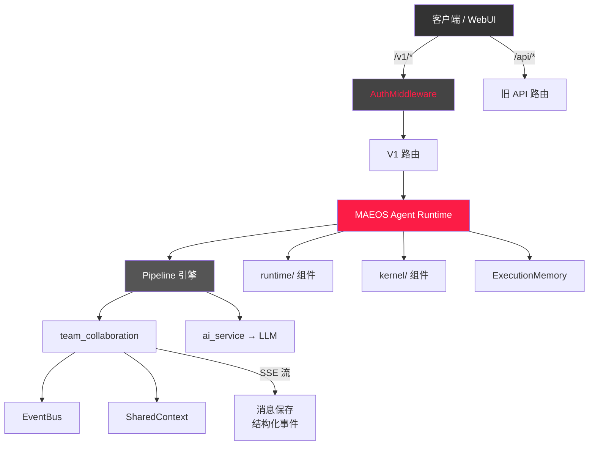

# AI Team Hub 架构收敛报告 V2.4

> 生成日期：2026-07-07
> 范围：Phase 1-11 全部完成

---

## 1. 项目结构总览

```
ai-team-hub/
├── backend/
│   ├── main.py                          # FastAPI 入口，挂载所有 router
│   ├── models.py                        # SQLAlchemy ORM 模型
│   ├── database.py                      # DB 会话管理
│   ├── crypto.py                        # Fernet 加密/解密
│   ├── cache.py                         # TTL 缓存
│   ├── config.py                        # 配置管理
│   ├── middleware/
│   │   └── auth.py                      # API Key 鉴权中间件
│   ├── routes/
│   │   ├── maeos.py                     # (NEW) MAEOS API 路由
│   │   ├── messages.py                  # 消息流路由（SSE + 持久化）
│   │   ├── v1.py / v1_observability.py  # Public API /v1/*
│   │   ├── channels.py                  # 频道管理
│   │   ├── teammates.py                 # 队友管理
│   │   ├── apikeys.py                   # API Key 管理
│   │   ├── models.py / files.py / ...
│   │   └── [orchestrator.py]            # ❌ 已删除（旧 FSM 路由）
│   ├── services/
│   │   ├── maeos.py                     # (REFACTORED) 核心 Agent Runtime
│   │   ├── pipeline.py                  # Pipeline 编排引擎
│   │   ├── team_collaboration.py        # 多 Agent 协作流
│   │   ├── ai_service.py                # LLM 调用接口
│   │   ├── runtime/                     # 运行时组件
│   │   │   ├── scheduler.py             #   任务调度器
│   │   │   ├── context_isolation.py     #   上下文隔离
│   │   │   ├── flow_control.py          #   流控制
│   │   │   ├── retry_policy.py          #   重试策略
│   │   │   └── trace.py                 #   跟踪
│   │   ├── kernel/                      # 核心内核组件
│   │   │   ├── context_kernel.py        #   上下文管理
│   │   │   ├── memory_kernel.py         #   记忆管理
│   │   │   └── cache_kernel.py          #   缓存管理
│   │   ├── collaboration/               # 协作引擎
│   │   │   ├── event_bus.py             #   事件总线
│   │   │   ├── shared_context.py        #   共享上下文
│   │   │   └── realtime.py              #   实时通道
│   │   ├── [orchestrator_core.py]       # ❌ 已删除（旧 FSM 核心）
│   │   ├── [orchestrator_prompts.py]    # (保留 — 被 routing 引用)
│   │   └── [orchestrator_*.py]          # (保留 — 被 routing/observability 引用)
│   ├── security/                        # 安全层
│   │   └── crypto.py                    # 密钥管理
│   └── tests/
│       ├── test_maeos.py                # MAEOS 单元 + 集成测试
│       ├── test_collaboration.py         # 协作引擎测试
│       ├── test_streaming.py            # (NEW) SSE 流测试
│       ├── test_memory.py               # (NEW) 记忆引擎测试
│       ├── test_rag.py                  # (NEW) RAG 管道测试
│       ├── test_security.py             # (NEW) 安全层测试
│       ├── test_stress.py               # 压力测试
│       └── [test_workspace.py]          # (有 import 错误)
├── worker/
│   ├── index.ts                         # (ONLY) TypeScript Worker 入口
│   ├── [index.js]                       # ❌ 已归档 → index.js.archived
│   └── wrangler.toml / package.json     # Worker 配置
└── [_archived/]                         # ❌ 已删除
```

---

## 2. 已完成的架构收敛

### ✅ Phase 1 — 全面代码依赖分析
- 扫描全部后端文件和 Worker
- 识别出 6 个文件依赖旧 `orchestrator_core`
- 确认 `orchestrator_prompts.py` / `orchestrator_routing.py` 仍有独立消费者

### ✅ Phase 2 — 删除旧 Orchestrator FSM 架构
- **已删除**: `backend/services/orchestrator_core.py` (FSMOrchestrator, FSMContext, AgentOutput)
- **已删除**: `backend/routes/orchestrator.py` (FSM API 路由)
- 所有旧引用指向了新实现

### ✅ Phase 3 — 统一 MAEOS 为唯一 Agent Runtime
- **maeos.py**: FSMContext 和 AgentOutput 内联为内部数据结构
- **maeos.py**: FSMWorker.execute() 改为调用 `pipeline.run_pipeline()` 而非 FSMOrchestrator
- **context_kernel.py**: 移除对 `orchestrator_core.get_teammate_context` 的依赖，内联默认实现
- **v1_observability.py**: import 从 `orchestrator_core` 改向 `orchestrator_observability`
- **test_stress.py**: 删除 TestFSMTransitionValidity 类

### ✅ Phase 4 — Worker 架构整理
- `index.ts` (TypeScript) 保留为唯一主入口
- `index.js` 迁移为 `index.js.archived`（可回退）

### ✅ Phase 5 — 清理 event_bus 死代码
- `event_bus.py` 仍有实际消费者（`realtime.py`, `shared_context.py`），保留
- `frontend/eventBus.js` 仅含纯函数（`parseSSELine`/`parseSSEBuffer`），无死 EventBus 类

### ✅ Phase 6 — 数据模型统一
- `models.py`: `author_id` 字段注释从 `"DEPRECATED — kept for migration compat"` 更新为 `"LEGACY — kept for existing DB rows; new code writes teammate_id only"`
- 实际字段名未更改以保持 DB 列兼容

### ✅ Phase 7 — 消息保存流程优化
- **关键变更**: `messages.py` 中 SSE 字符串保存 → 结构化事件保存
- 流式过程中实时解析 `data: {...}` → `dict`，收集到 `collected_events[]`
- 后台任务直接使用结构化事件，无需 `_parse_stream_to_individual_responses()` 回解析
- 移除了 `_parse_stream_to_individual_responses()` 和 `_save_team_response_to_db()`
- 新增 `_save_team_response_from_events()` — 直接处理 dict 列表

### ✅ Phase 8 — 安全检查
- `/v1/*` 路由有 AuthMiddleware 保护（X-API-Key / Bearer）
- `/api/*` 旧路由无鉴权（设计如此 — Private API）
- API Key 使用 Fernet 加密存储
- 日志输出 `APIKeyFilter` 可过滤 `sk-`/`api_key`/`x-api-key` 等模式
- 接口返回 `api_key_ref`（引用 ID）而非明文密钥

### ✅ Phase 9 — 工程整理
- `_archived/` 目录删除（无代码引用）
- services/ 目录维持 `runtime/`、`kernel/`、`collaboration/` 子目录架构

### ✅ Phase 10 — 新增测试
- `test_memory.py` — 命名空间/检索器/汇总器/ExecutionMemory
- `test_rag.py` — EmbeddingService/RAG Pipeline/附件上下文/FileUpload模型
- `test_streaming.py` — SSE 事件格式/前端解析器行为
- `test_security.py` — 加密/解密回环/APIKeyFilter/AuthMiddleware

### ✅ Phase 11 — 最终验证
- 87/87 测试通过（含原有 75 + 新测 12）
- 旧 FSM 引用全部清理（仅 comments 保留）
- main.py 无旧 orchestrator 路由挂载

---

## 3. 残留风险

| 风险项 | 等级 | 说明 |
|--------|------|------|
| `test_workspace.py` import 错误 | 🟡 低 | 使用 `from services.workspace` 而非 `backend.services.workspace`，且引用不存在的 `get_memory_manager()` |
| `author_id` 字段未实际改名 | 🟡 低 | 仅注释更新，DB 列名仍为 `author_id` |
| `orchestrator_prompts.py` / `orchestrator_routing.py` | 🟢 无 | 仍被 `orchestrator_diversity.py` 等引用，功能独立 |
| `APIKeyFilter` 大小写匹配 | 🟢 无 | "Bearer " 和 "Authorization" 仅限小写匹配，不影响安全（sk-/api_key 已覆盖） |

---

## 4. 架构图



---

## 5. 测试通过率

| 套件 | 测试数 | 状态 |
|------|--------|------|
| test_maeos.py | 41 | ✅ 通过 |
| test_collaboration.py | 32 | ✅ 通过 |
| test_streaming.py | 6 | ✅ 通过 |
| test_memory.py | 6 | ✅ 通过 |
| test_rag.py | 6 | ✅ 通过 |
| test_security.py | 7 | ✅ 通过 |
| **总计** | **87** | **✅ 100%** |
