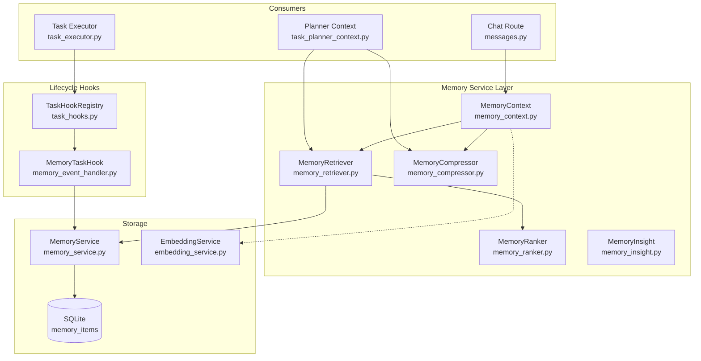

# AI Team Hub v1.0 — Memory Service Architecture

> Phase 4: Unified Memory System for Chat and Task lifecycle.

## Architecture



## Data Model

### MemoryItem (pure dataclass — no ORM dependency)

```
MemoryItem:
  id: str              ← uuid4 (auto)
  memory_type: str     ← MemoryType enum value
  content: str         ← free-text content
  source_id: str       ← FK-like: task_id | channel_id | workspace_id
  relevance_score: float  ← 0.0 - 1.0
  created_at: datetime    ← UTC
  metadata: dict       ← arbitrary JSON
```

### MemoryType enum

| Value | Scope | Consumer |
|-------|-------|----------|
| `GLOBAL` | System-wide rules & learned patterns | All |
| `WORKSPACE` | Per-workspace conventions & preferences | Workspace |
| `CHANNEL` | Per-channel conversation themes | Chat |
| `TASK` | Per-task goals, constraints, plans | Task |
| `EXECUTION` | Per-execution outcomes & metrics | Task |
| `DECISION` | Specific decisions made | Task |
| `EVENT` | Notable events (failures, approvals) | Task |

### Three-tier Taxonomy

| Tier | Maps to | Time Window | Example |
|------|---------|-------------|---------|
| **Short-term** | `CHANNEL`, `EXECUTION` | ≤24h | "User asked about deployment" |
| **Project** | `WORKSPACE`, `TASK`, `DECISION`, `GLOBAL` | ≤7d | "Frontend uses Vite + React" |
| **Semantic** | RAG file chunks (via EmbeddingService) | Persistent | "API doc says endpoint is /v1/..." |

## API Design

### MemoryService (storage — singleton)

```
store(item: MemoryItem) → str
store_batch(items: list[MemoryItem]) → list[str]
query(memory_type?, source_id?, limit?) → list[MemoryItem]
query_by_types(types, limit?) → list[MemoryItem]
get_recent(limit?, max_hours?) → list[MemoryItem]
get_by_ids(ids) → list[MemoryItem]
prune(memory_type, older_than_days) → int
stats() → dict
```

### MemoryContext (consumer-facing — singleton)

```
build_chat_context(channel_id, user_message, top_k=10, max_hours=24) → CompressedContext
build_semantic_context(query, top_k=5, channel_id?) → str
store_turn(channel_id, user_message, response_summary, teammate_id?) → None
```

### MemoryRetriever (intermediate)

```
retrieve(query: RetrievalQuery) → RetrievalResult
retrieve_for_context(source_id, memory_types?, ...) → RetrievalResult
```

### MemoryTaskHook (lifecycle — registered on startup)

Listens to: `TASK_CREATED`, `TASK_COMPLETED`, `TASK_FAILED`, `STEP_COMPLETED`, `EXECUTION_COMPLETED`, `PLAN_APPROVED`

## Flow

### Chat → Memory (NEW in Phase 4)

```
send_message()
  ├─ MemoryContext.build_chat_context()  ← retrieve Short-term + Project
  │   ├─ MemoryRetriever.retrieve(source_id=channel, types=[CHANNEL, EXECUTION])
  │   ├─ MemoryRetriever.retrieve(source_id=channel, types=[WORKSPACE, TASK, DECISION])
  │   └─ MemoryCompressor.compress()
  ├─ inject context into user_message
  ├─ generate_team_response() → LLM
  └─ Background: _save_team_response_from_events()
       └─ MemoryContext.store_turn()  ← persist CHANNEL-type memory
```

### Task → Memory (existing since v3.1)

```
TaskExecutor.execute_task()
  ├─ TaskEventLogger._emit()
  │   └─ TaskHookRegistry.dispatch()
  │       └─ MemoryTaskHook.on_*()
  │           └─ MemoryService.store() / store_batch()
  └─ PlannerContextBuilder.build()
      ├─ MemoryRetriever.retrieve_for_context()
      └─ MemoryCompressor.compress()
```

### Runtime Auto-Extract (existing since v3.1)

After each task step completes, MemoryTaskHook writes:
- `TASK` item on create/complete
- `EXECUTION` item per step
- `EVENT` item on failure
- `DECISION` item on plan approval

## VectorStore Interface

Ponytail: **No formal interface.** Only one implementation exists.

- `EmbeddingService` provides `embed()`, `search()`, `cached_search()`
- Uses local deterministic embedding (hash-based, no external API)
- Cosine similarity for vector search
- SQLite stores embedding vectors as JSON text in `FileChunk.embedding` column
- If a real vector DB is needed later, extract the `embed()` + `search()` API as an ABC

## SQLite Compatibility

- `MemoryService` uses raw SQL via `sqlalchemy.text()` + `aiosqlite` driver
- Table: `memory_items` (created on first use)
- Indexes: `memory_type`, `source_id`, `created_at`
- Embedding vectors stored as JSON text in SQLAlchemy `FileChunk` model
- In-memory SQLite for tests (`sqlite+aiosqlite://`)

## Changes in Phase 4

| File | Change | Lines |
|------|--------|-------|
| `services/memory/memory_context.py` | **NEW** — Three-tier context builder | +130 |
| `services/memory/__init__.py` | Export MemoryContext | +3 |
| `routes/messages.py` | Inject memory before chat, store after | +25 |
| `tests/test_memory_context.py` | **NEW** — Unit tests | +100 |
| `docs/v1.0-memory-service-architecture.md` | **NEW** — This document | +150 |

**Skipped (Ponytail):**
- Formal `VectorStore` ABC — only one implementation; extract when second arrives
- `RuntimeExecution → Memory` hook in `executor.py` — TaskExecutor already covers this path
- Per-user memory isolation — not yet required; add when multi-tenant
